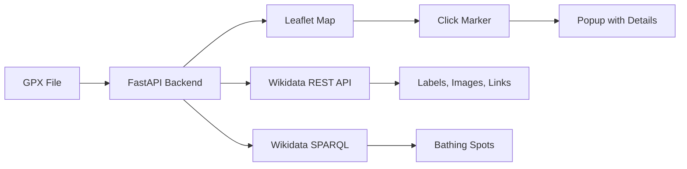

# Bathing Route

Find EU bathing spots (P9616) along a GPX route from GraphHopper, using Wikidata as the data source.

## Requirements

- Python 3.12
- Node.js 20+
- [uv](https://github.com/astral-sh/uv)
- [Just](https://github.com/casey/just)

## Install

```bash
just install
```

This installs backend dependencies with `uv sync --extra dev` and frontend dependencies with `npm install --legacy-peer-deps`.

## Start

Start both the API and frontend in separate terminals:

```bash
just api   # FastAPI server on http://localhost:8000
just vite  # Vite dev server on http://localhost:5173
```

## Development

### Linting

```bash
just be-lint   # Backend: ruff + mypy + file length check
just fe-lint   # Frontend: vue-tsc
```

### Testing

```bash
just test-all  # Run backend and frontend tests
just be-test   # Backend only (pytest, 80% coverage required)
just fe-test   # Frontend only (vitest)
```

## Architecture



### Data Flow

1. User uploads GPX file
2. Backend parses route and finds bathing spots within buffer
3. Frontend displays spots on Leaflet map
4. On marker click, backend fetches spot details from Wikidata
5. Details cached in SQLite for 7 days

### Backend Details

- **Framework**: FastAPI + uvicorn
- **GPX parsing**: gpxpy
- **Geo buffering**: shapely + pyproj
- **SPARQL backends**: Wikidata Query Service (default) or QLever
- **Bathing spots cache**: SQLite (aiosqlite), 24h TTL, stored at `backend/sites.db`
- **Labels/details cache**: SQLite (aiosqlite), 7-day TTL, stored at `backend/wikidata.db`
- **Label source**: Wikidata REST API (labels never come from SPARQL)

### Frontend Details

- **Framework**: Vue 3 + Vite + TypeScript
- **Map**: Leaflet (native, not vue-leaflet)
- **UI**: Bootstrap 5 + vue-i18n (English / Swedish)
- **State**: Composables (`useRoute.ts`)
- **Image handling**: Commons images proxied through backend to avoid CORS

## Environment

No environment variables are required. The app is configured to work out of the box with the default WDQS backend.
